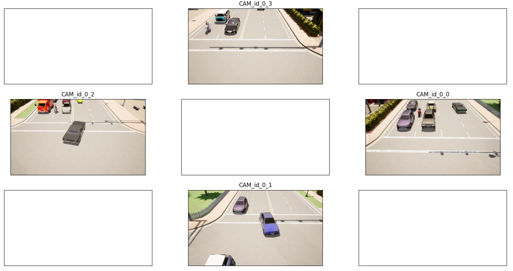
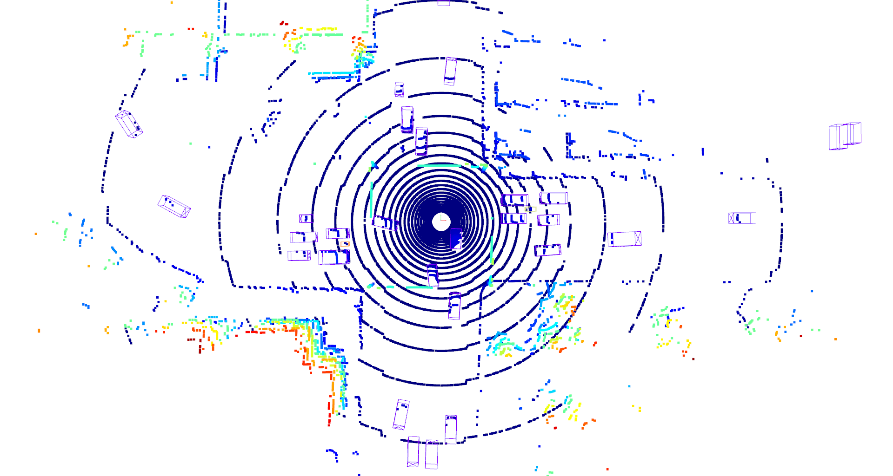
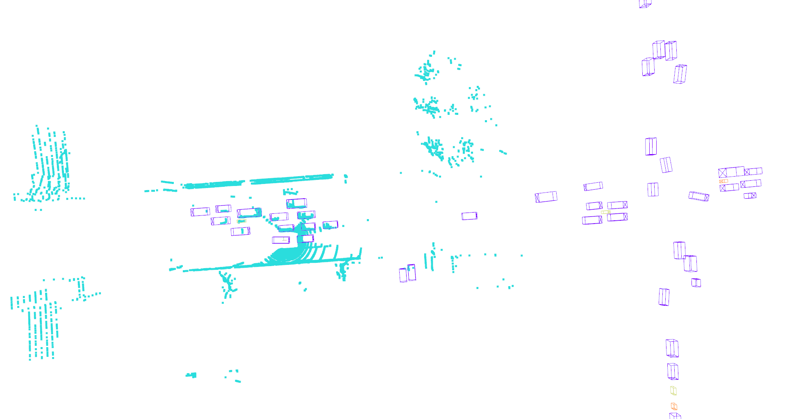
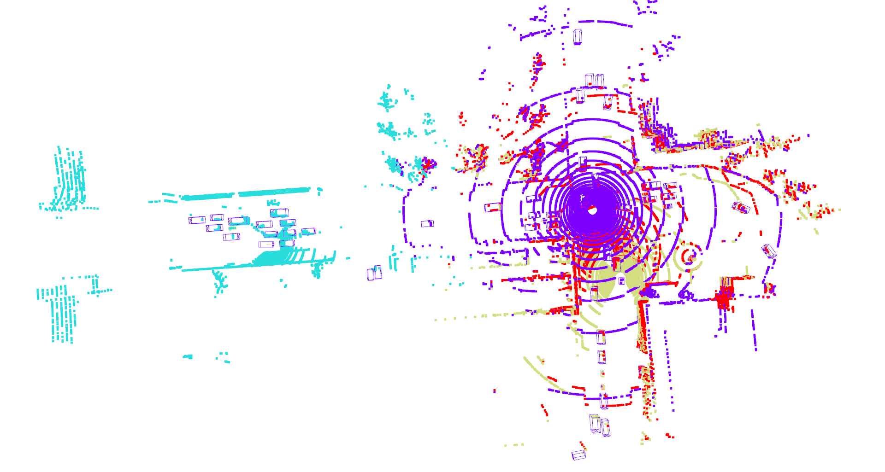
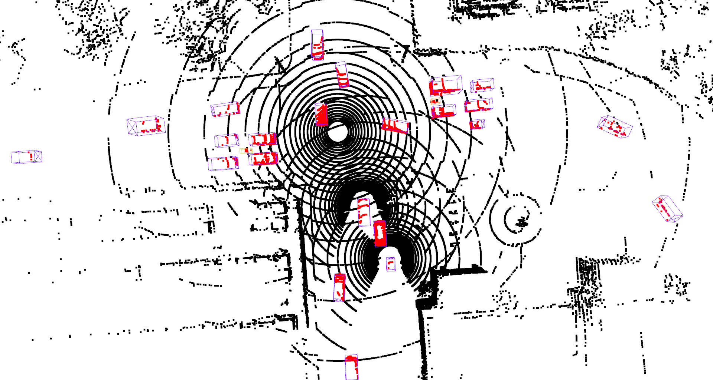
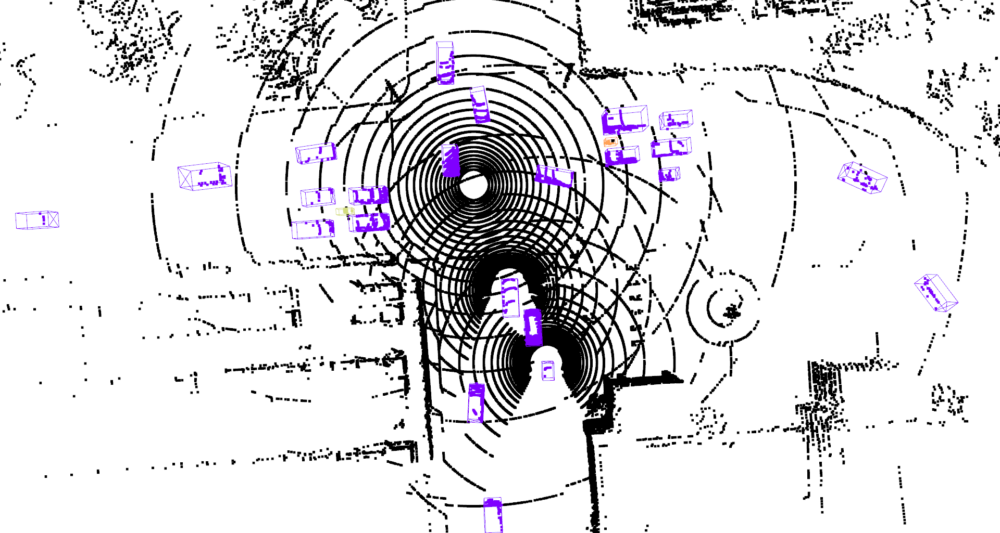
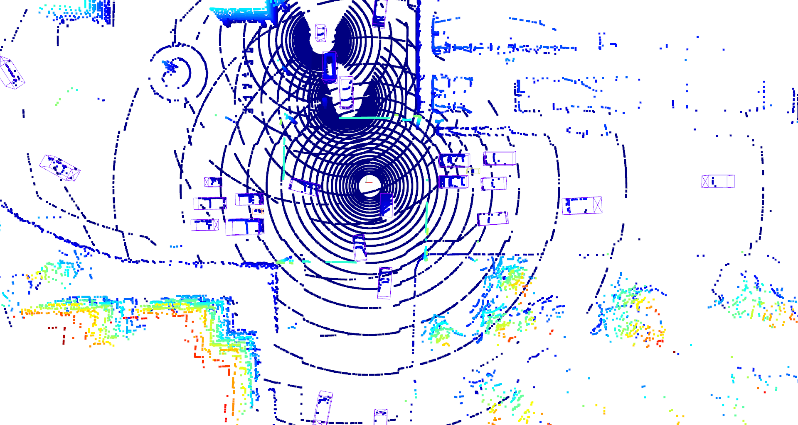
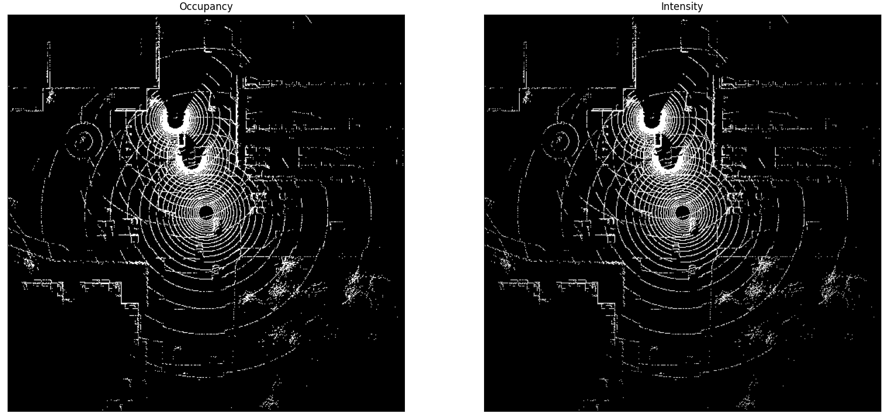

# AUVE - Cooperative Perception
This lab introduces you to a recent trend in autonomous vehicles research called vehicle-to-everything (V2X) 
cooperative perception.  

Data used in this lab is from the newly released [V2X-Sim dataset](https://ai4ce.github.io/V2X-Sim/).

In this lab, you will perform various tasks to make the data ready for training deep learning models such as 
reading point clouds from files, transforming point clouds to different frames, parsing annotations.

These tasks are organized into 4 exercises which details can be found in this 
[Notion note](https://bow-spark-d07.notion.site/AUVE-Cooperative-Perception-f9754a478592465694772c373e7a9889)

## Ex.1 Single-source measurement
This exercise is about showing measurements made by the Intelligent Road-Side Unit (IRSU) positioned at the center of 
the intersection. Its measurements include
* 4 RGB images show the traffic flowing from 4 direction at the intersection

  

* 1 point clouds collected by a 32-channel LiDAR

  

 
## Ex.2 Point Clouds Transformation
This exercise demonstrates how the field of view and perception range of a vehicle can be enhanced by receiving data
from other vehicles and the IRSU.

  

Fig. Point cloud collected by a vehicle

  

Fig. Augmented point cloud by V2X

## Ex.3 Generate Foreground Segmentation Label
Foreground segmentation, that is to separate points belong to foreground objects (e.g. cars, buses, pedestrians) 
from background points (e.g. road, building, plantation), is a fundamental tasks of many 3D perception pipelines. 
In this exercise, you will create the ground truth for training a foreground segmentation model using the ground truth
3D bounding boxes provided by V2X-Sim.

  

Fig. Augmented point cloud with foreground points marked by red

  

Fig. Augmented point cloud with foreground points marked by classes' color

## Ex.4 Generate Bird-Eye View (BEV) Image
A main challenge in perception on point clouds is their unordered nature which hinders the application of the 
Convolution operation, thus preventing the use of many wonders in the world of image-based perception. 
An effective way to get around this challenge is to convert point clouds to BEV images. 
In other word, to look at a point cloud from the top-view which is what you are going to do in this exercise.

  

Fig. Point cloud in IRSU frame viewed from a view point on the z-axis. Viewing direction is in the 
reversed direction of z-axis

  

Fig. BEV images of point cloud in IRSU frame

